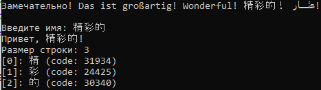

# DialogBlocksConsoleAppHello
Пример простейшей консольной программы на C++ с использованием wxWidgets и DialogBlocks для Visual Studio 2022



```
#include <wx/wx.h>

#ifdef _WIN32 // Если это Windows
#include <io.h>
#include <fcntl.h>
#endif 

int main(int argc, char** argv)
{
	setlocale(LC_ALL, "ru_RU.UTF-8"); // Установить русскую локаль для Linux
	wxLocale m_locale; // Создать объект локали для wxWidgets
	m_locale.Init(wxLANGUAGE_RUSSIAN, wxLOCALE_DONT_LOAD_DEFAULT); // Установить локаль для wxWidgets

#ifdef __WXMSW__ // Определение для Windows
	_setmode(_fileno(stdout), _O_U16TEXT); // Установить Юникод для вывода в консоли Windows
	_setmode(_fileno(stdin), _O_U16TEXT); // Установить Юникод для ввода в консоли Windows
	_setmode(_fileno(stderr), _O_U16TEXT); // Установить Юникод для вывода ошибок в консоли Windows
#endif

	wxPuts(L"Замечательно! Das ist großartig! Wonderful! 精彩的！ رائع!\n");
	wxPrintf(L"Введите имя: ");
	std::wstring fio; // Создать строковую переменную
	std::wcin >> fio; // Считать строку
	wxPuts(L"Привет, " + fio + L"!"); // Вывести строку
	wxPuts(L"Размер строки: " + std::to_wstring(fio.length())); // Вывести размер строки
	for (int i = 0; i < fio.length(); i++) {
		wxPuts("[" + std::to_wstring(i) + "]: " + fio[i] + " (code: " +
			std::to_wstring(int(fio[i])) + ")");
	}

#ifdef __WXMSW__ // Определение для Windows
	system("pause"); // Приостановить выполнение программы
#else // Определение для Linux
	system("read -p \"Нажмите Enter для продолжения...\"  var"); // Приостановить выполнение программы
#endif

	return 0;
}
```

## Настройки DialogBlocks:

**WXWIN:** D:\Development\CPP\wxWidgetsDBls

**DBPROJECTS:** D:\Projects\DialogBlocksProjects

**MSBUILDDIR:** C:\Program Files\Microsoft Visual Studio\2022\Community\MSBuild\Current\Bin

**MSVCDIR:** C:\Program Files\Microsoft Visual Studio\2022\Community

**PLATFORMSDK:** C:\Program Files (x86)\Windows Kits\10

**VC++ version:** 17 <<-- Microsoft Visual Studio Community 2022 (64-разрядная версия) - Версия 17.8.2

**VC++ tools version:** 14.38.33130 <<-- C:\Program Files\Microsoft Visual Studio\2022\Community\VC\Tools\MSVC\14.38.33130

**Full Platform SDK version**: 10.0.22621.0 <<-- C:\Program Files (x86)\Windows Kits\10\bin\10.0.22621.0

**Message encoding:** cp866

*Чтобы компилировался проект без BOM в UTF-8 в конфигурации сборки укажите:*

**Extra compile flags:** %AUTO% /utf-8

*Чтобы компилировался проект в режиме консоли в конфигурации каждой сборки также укажите:*

**GUI mode:** Console

## Ссылки:

http://www.anthemion.co.uk/dialogblocks/DialogBlocks-5.18-beta3-Setup.exe

http://www.anthemion.co.uk/dialogblocks/

https://www.wxwidgets.org/

https://visualstudio.microsoft.com/ru/vs/community/

http://www.anthemion.co.uk/dialogblocks/ImageBlocks-1.06-Setup.exe
